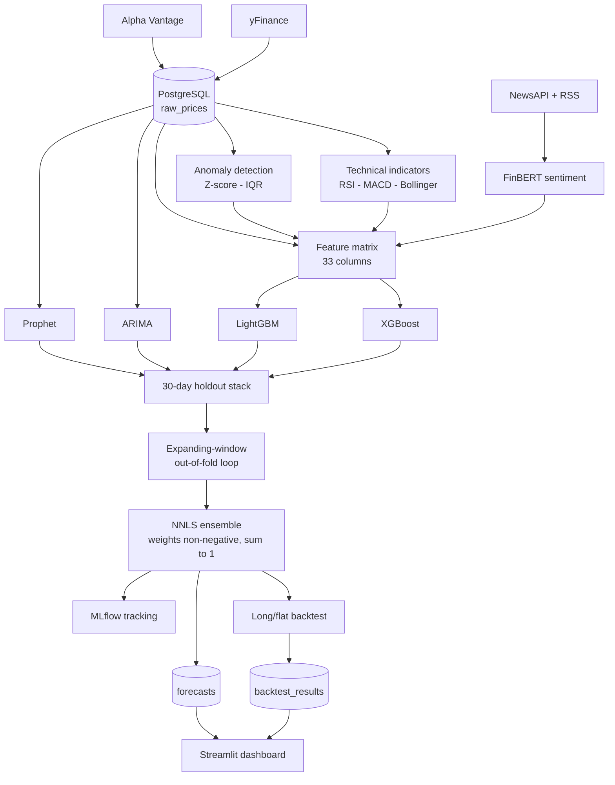

# QuantFlow

A stock analytics pipeline that ingests market data, engineers features from price, sentiment and anomaly signals, and compares five forecasting models under a leakage-controlled evaluation harness.

[](https://quantflow-analytics.streamlit.app)
[](https://www.python.org/)
[](https://supabase.com/)
[](https://mlflow.org/)
[](LICENSE)

**Live dashboard: [quantflow-analytics.streamlit.app](https://quantflow-analytics.streamlit.app)**

---

## What it does

- **Ingests** OHLCV bars for 8 tickers from yFinance and Alpha Vantage into PostgreSQL, on a 15-minute APScheduler interval.
- **Computes** RSI(14), MACD(12/26/9), Bollinger Bands(20), rolling Z-score and IQR anomaly flags, and FinBERT sentiment over NewsAPI and Yahoo Finance RSS headlines.
- **Forecasts** 7 days ahead with five models — ARIMA, Prophet, XGBoost, LightGBM, and an NNLS stacking ensemble over the four — from a 33-column feature matrix.
- **Evaluates** every model on a time-ordered holdout, scores the ensemble out-of-fold, and simulates a long/flat trading strategy against buy-and-hold.

---

## Architecture



Data flows one way. `quantflow.models` depends on `quantflow.evaluation`, never the reverse, so scoring cannot come to depend on training internals.

---

## Evaluation

**How the evaluation set is built.** Intraday bars are collapsed to one close per trading date, giving **579 daily closes per ticker** spanning 2024-04-10 to 2026-08-04. The final **30 trading days** are held out. The split is positional on a date-sorted series — `train = df.iloc[:-30]`, `holdout = df.iloc[-30:]` — defined once in [evaluation/splits.py](src/quantflow/evaluation/splits.py). There is no random shuffle anywhere in the codebase.

**What counts as success.** MAPE against actual closes, because it is unit-free and therefore comparable across tickers trading at very different prices. A model is better than another only when scored on the same window over the same horizon.

### Base models — 30-day holdout

| Ticker | ARIMA | Prophet | XGBoost | LightGBM |
|---|---|---|---|---|
| AAPL | 5.68% | 6.92% | **4.23%** | 4.83% |
| MSFT | 4.52% | 12.81% | 2.89% | **2.64%** |
| GOOGL | 3.66% | 15.14% | **2.28%** | 2.38% |
| AMZN | 3.62% | 16.72% | **2.26%** | 2.30% |
| NVDA | 5.46% | 18.23% | **2.18%** | 2.58% |
| TSLA | 11.07% | 21.35% | **2.60%** | 2.79% |
| META | 6.27% | 9.32% | **2.98%** | 3.13% |
| JPM | 3.56% | **2.40%** | 5.14% | 4.94% |
| **Mean** | 5.48% | 12.86% | **3.07%** | 3.20% |

> **These four columns are not measuring the same task, and the gap is mostly the task.**
>
> ARIMA and Prophet produce a genuine 30-step-ahead forecast: fit on train, then project 30 days with no further access to actuals, so day 30 is predicted 30 days blind ([models/statistical.py](src/quantflow/models/statistical.py)). XGBoost and LightGBM predict on holdout rows that carry the *actual* lagged close, rolling statistics and indicators for each day — 30 independent **one-step-ahead** predictions given a true yesterday ([models/boosting.py](src/quantflow/models/boosting.py)).
>
> Reading this table as "gradient boosting beats ARIMA by 44%" would be wrong. Making it like-for-like requires either walk-forward refitting for the boosters or a recursive rollout scored against actuals. That work is open — see [docs/architecture.md](docs/architecture.md).

A second consequence: the 7-day forecast shown on the dashboard is produced by feeding each prediction back in as the next day's lag, so its error compounds. **The holdout MAPE above does not describe the accuracy of the published 7-day forecast.**

### Stacking ensemble — measured out-of-fold

The ensemble is scored with an expanding window: for each day, an NNLS meta-learner is fitted only on days before it ([evaluation/out_of_fold.py](src/quantflow/evaluation/out_of_fold.py)). Fitting the first meta-learner consumes a 10-day warmup, leaving a **20-day** evaluation window, and base models are re-scored on that same 20 days so the comparison is like-for-like.

| Ticker | Best base (same window) | Ensemble (out-of-fold) | vs best base |
|---|---|---|---|
| AAPL | Prophet 5.19% | **2.83%** | **+45.5%** |
| META | XGBoost 2.87% | 3.10% | −8.0% |
| JPM | Prophet 2.79% | 3.55% | −27.2% |
| MSFT | LightGBM 3.12% | 6.30% | −101.9% |
| TSLA | XGBoost 2.58% | 5.37% | −108.1% |
| GOOGL | LightGBM 2.31% | 5.29% | −129.0% |
| NVDA | XGBoost 2.10% | 8.59% | −309.1% |
| AMZN | LightGBM 2.32% | 11.44% | −393.1% |

**The ensemble beats the best single base model on 1 of 8 tickers.** Mean out-of-fold ensemble MAPE is 5.81%, against best-base figures clustered at 2–3%.

An earlier version of this project reported the ensemble as best on all eight. That came from scoring the meta-learner on the same 30 days it was fitted on, which cannot lose by construction. With the leak removed, a convex combination constrained to non-negative weights gets dragged toward whichever base models are noisy on a given ticker, and 20 days is too few for the weights to settle. The ensemble is kept because it genuinely helps on AAPL, and because its learned weights are a readable diagnostic of which model the data favours — not because it is a general improvement.

### Strategy backtest — 20-day out-of-fold window

Long when the ensemble predicts a rise, flat otherwise. One-day holding period, 0.1% per-trade cost, no shorting or leverage.

| Ticker | Strategy | Buy and hold | Trades |
|---|---|---|---|
| AAPL | +4.76% | −2.64% | 3 |
| AMZN | +16.38% | +12.48% | 1 |
| GOOGL | +0.16% | −0.16% | 1 |
| META | +0.29% | −4.74% | 3 |
| NVDA | +9.57% | +9.68% | 1 |
| MSFT | −0.24% | +24.51% | 1 |
| TSLA | −22.43% | −22.35% | 1 |
| JPM | 0.00% | +5.34% | 0 |
| **Mean** | **+1.06%** | **+2.77%** | 1.4 |

**This demonstrates the harness, not an edge.** The strategy beats buy-and-hold on 4 of 8 tickers and underperforms it on average, over **11 total trades across all eight tickers**. No conclusion about profitability is supportable from a sample that size. Annualised return, Sharpe and alpha are computed and logged, but are not reported here: scaling a 20-day window by 252/20 turns MSFT's −0.24% into an alpha of −1485%, which is arithmetic rather than information.

### Reproducing these figures

Every number above was measured on **2026-08-04** and is recorded in `mlflow.db` and `logs/pipeline.log`. Both are gitignored, so a fresh clone must regenerate them — which needs a seeded database and roughly two years of history per ticker:

```bash
make seed && make indicators && make anomalies && make sentiment && make models && make backtest
```

Read them back with `mlflow ui` (http://localhost:5000), or from the `model_metrics` and `backtest_results` tables. Figures shift as new market data arrives; regenerate rather than trusting a stale copy.

The evaluation *contract* — that scoring is out-of-fold, that windows are like-for-like, that degenerate input reports nothing rather than a fabricated number — is asserted on synthetic data and needs no database:

```bash
make eval
```

---

## Evaluation integrity

The controls that keep the numbers above defensible. Each is enforced by a test, not just a convention.

| Control | Where | Test |
|---|---|---|
| Train/test split is time-ordered, never shuffled | [evaluation/splits.py](src/quantflow/evaluation/splits.py) | [test_splits.py](tests/unit/test_splits.py) |
| Features are backward-looking — lags shift positive, rolling windows trail, sentiment forward-fills | [features/engineering.py](src/quantflow/features/engineering.py) | [test_engineering.py](tests/unit/test_engineering.py) |
| Ensemble scored out-of-fold; no prediction sees its own actual or any later one | [evaluation/out_of_fold.py](src/quantflow/evaluation/out_of_fold.py) | [test_ensemble.py](tests/unit/test_ensemble.py) |
| Base models re-scored on the ensemble's window, not the full holdout | [models/ensemble.py](src/quantflow/models/ensemble.py) | [test_ensemble_evaluation.py](tests/evals/test_ensemble_evaluation.py) |
| Backtest runs on out-of-fold predictions only, never in-sample | [evaluation/backtest.py](src/quantflow/evaluation/backtest.py) | [test_backtest.py](tests/unit/test_backtest.py) |
| One definition each of MAPE, RMSE and MAE | [evaluation/metrics.py](src/quantflow/evaluation/metrics.py) | [test_metrics.py](tests/unit/test_metrics.py) |
| Config fails fast on a missing password or empty ticker list | [config.py](src/quantflow/config.py) | [test_config.py](tests/unit/test_config.py) |

The leakage test is worth reading directly: it perturbs every input column from row *k* onward and asserts that no feature value before *k* moves, plus a second test that plants a deliberate forward-looking column to prove the probe actually fires.

---

## Quickstart

### Docker

```bash
docker build -t quantflow .
```

```bash
docker run -p 8501:8501 --env-file .env quantflow
```

Serves the dashboard on http://localhost:8501. Requires a reachable PostgreSQL instance and a populated `.env` — the image ships no data.

### Local

Requires Python 3.11 and PostgreSQL 17, or a Supabase project.

```bash
git clone https://github.com/logn1602/QuantFlow.git
```

```bash
cd QuantFlow
```

```bash
python -m venv .venv
```

Activate it — `.venv\Scripts\activate` on Windows, `source .venv/bin/activate` on macOS and Linux — then install. `make install` installs both the dependencies and the `quantflow` package itself, which the pipeline commands need:

```bash
make install
```

Create the database, then apply all four schema files. Skipping `schema_backtest.sql` breaks the Backtest tab; skipping `schema_metrics.sql` leaves the Forecasts tab without MAPE figures:

```bash
psql -U postgres -c "CREATE DATABASE stock_pipeline;"
```

```bash
make setup
```

Copy the environment template and set `DB_PASSWORD`. Both API keys are optional — Alpha Vantage is unused by the default ingestion path, and sentiment falls back to the Yahoo Finance RSS feed without a NewsAPI key:

```bash
cp .env.example .env
```

Run the full pipeline. `make all` seeds roughly two years of history first, so
the first run takes several minutes; later runs skip rows that already exist:

```bash
make all
```

```bash
make dashboard
```

The offline test suite needs no database, network or model training, and can be run at any point:

```bash
make test
```

---

## Tech stack

**Data** — PostgreSQL (Supabase), SQLAlchemy, psycopg2, yFinance, Alpha Vantage, feedparser

**Modelling** — statsmodels (ARIMA), Prophet, XGBoost, LightGBM, SciPy (NNLS), pandas, NumPy

**NLP** — FinBERT (`ProsusAI/finbert`, pinned revision), transformers, PyTorch

**Serving** — Streamlit, Plotly, APScheduler

**Tooling** — MLflow, Ruff, mypy, pytest, pre-commit, gitleaks, Docker

MLflow is used for experiment tracking only. The Model Registry is not used — there is no `register_model`, `log_model` or `MlflowClient` call in the codebase.

Scheduling is APScheduler in a single process ([pipelines/scheduler.py](src/quantflow/pipelines/scheduler.py)): in-memory job store, no retries, no backfill, and stage ordering implied by wall-clock offsets rather than a dependency graph. It is a scheduler, not an orchestrator.

---

## Project structure

```
src/quantflow/
├── config.py              Environment loading and startup validation
├── db/                    All SQL: connection, prices, forecasts, metrics
├── ingestion/             yFinance and Alpha Vantage fetchers
├── features/              indicators, anomalies, sentiment, engineering
├── models/                statistical (ARIMA/Prophet), boosting, ensemble
├── evaluation/            splits, metrics, out_of_fold, backtest
├── pipelines/             seed, run_models, scheduler
└── dashboard/             Streamlit app

sql/                       Schema DDL and migrations
tests/
├── unit/                  Offline: no database, network or training
├── integration/           Requires a live database (empty)
└── evals/                 Full scoring path, @pytest.mark.eval
docs/architecture.md       Design decisions and trade-offs
```

---

## Configuration

| Variable | Required | Description |
|---|---|---|
| `DB_PASSWORD` | **yes** | Postgres password; the pipeline exits without it |
| `TICKERS` | **yes** | Comma-separated; defaults to `AAPL,MSFT,GOOGL,NVDA` |
| `DB_HOST` / `DB_PORT` / `DB_NAME` / `DB_USER` | no | Default to `localhost:5432/stock_pipeline` as `postgres` |
| `DB_SSLMODE` | no | Default `require`; see below |
| `DB_SSLROOTCERT` | no | CA bundle path, needed only for `verify-ca` / `verify-full` |
| `ALPHA_VANTAGE_API_KEY` | no | Only for the Alpha Vantage fetcher |
| `NEWS_API_KEY` | no | Without it, sentiment uses the RSS feed only |
| `FETCH_INTERVAL_MINUTES` | no | Scheduler interval, default 15 |
| `LOG_LEVEL` | no | Default `INFO` |

**Database TLS.** `DB_SSLMODE` defaults to `require` rather than libpq's `prefer`, because `prefer` falls back to cleartext silently — no exception, no log line — if the peer declines TLS, and this database is a public endpoint reached from a laptop, a CI runner and Streamlit Cloud. `require` encrypts but does not authenticate the peer. `verify-full` is the recommended upgrade; it needs `DB_SSLROOTCERT` pointing at Supabase's CA file, because the pooler certificate is signed by a private CA present in neither the system trust store nor certifi.

---

## Author

**Shubh Dave** — MS Data Analytics, Northeastern University

[LinkedIn](https://linkedin.com/in/shubh-dave) · [GitHub](https://github.com/logn1602)
